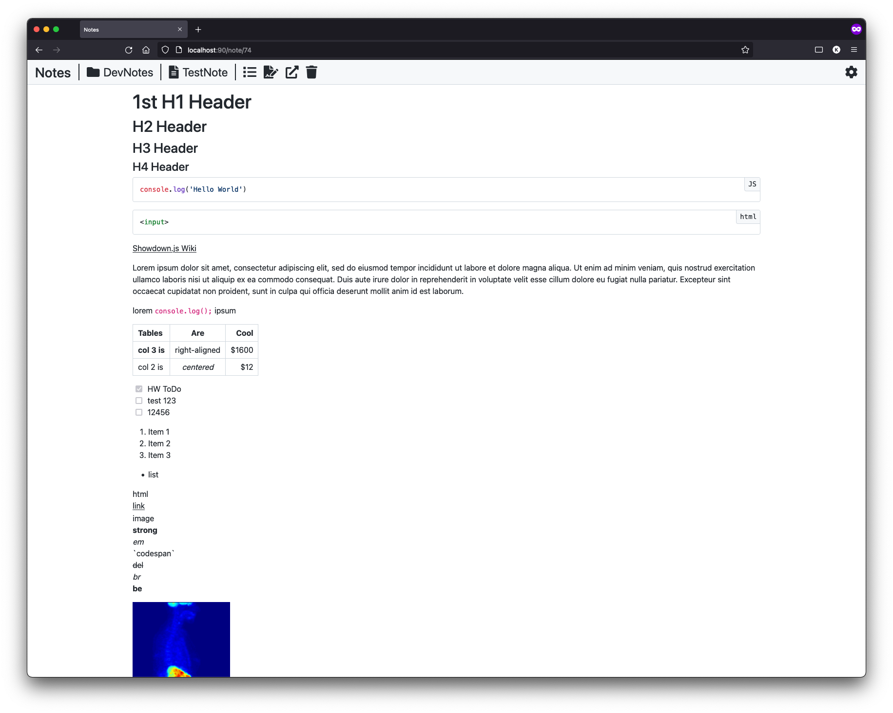

# Notes
Note-taking WebApp using Markdown



## Installation / Startup
```shell
git clone https://github.com/richardkrikler/Notes
docker compose up -d
cd src && bower install
```

## Export/Import Database
### Export NotesDB from Container
```shell
docker exec notes_db /usr/bin/mysqldump -uroot -pNotesPW NotesDB > database/NotesDB_backup.sql
```

### Import Notes.sql to Container
```shell
docker exec -i notes_db mysql -uroot -pNotesPW NotesDB < database/NotesDB_backup.sql
```